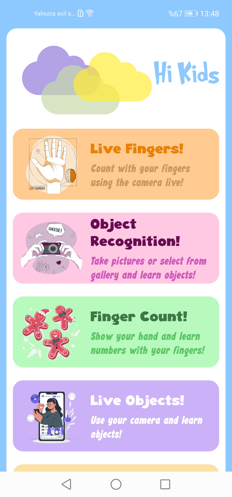
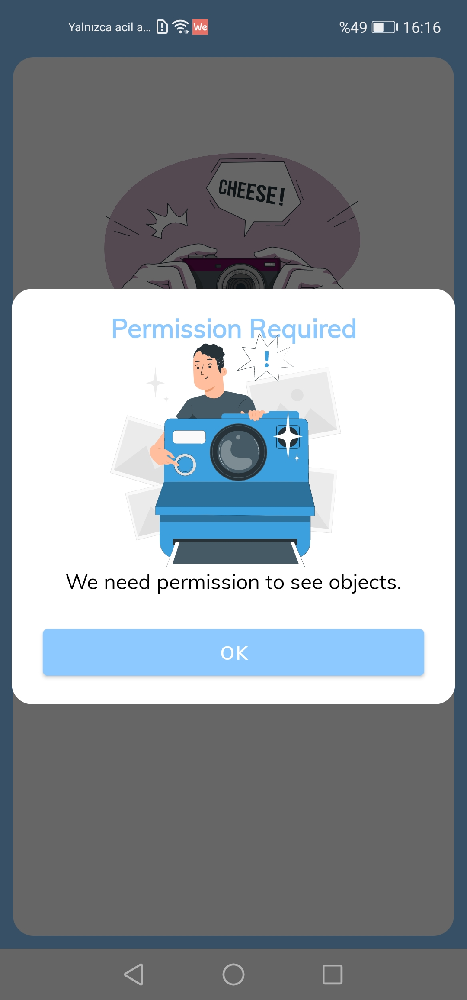
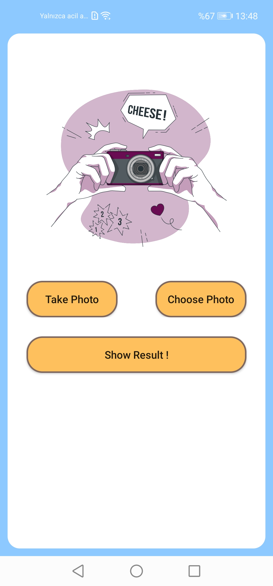
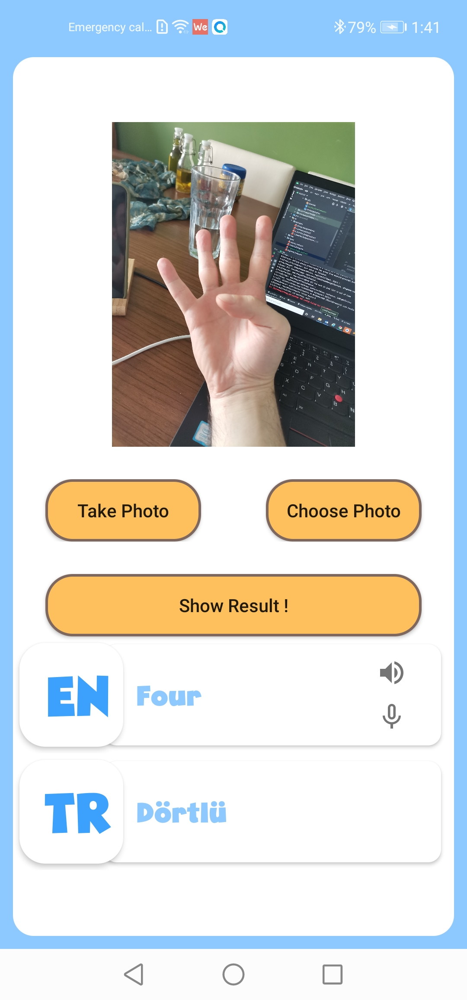
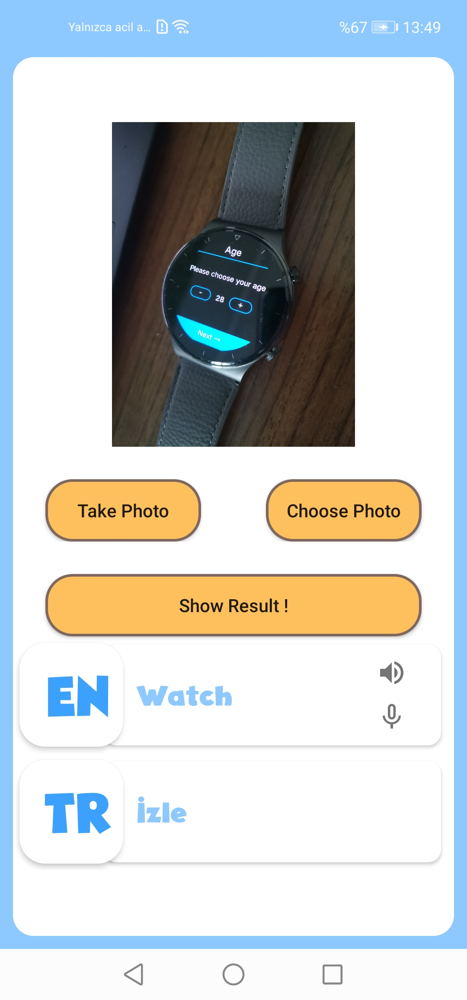

# Hi Kids

    

## Introduction

It is a game application for children to learn languages while having fun. Thanks to the games in the application, children can both learn basic concepts in different languages and have a pleasant time by playing games.

• Counting with fingers: A game of pronouncing the number of fingers shown by the child in different language in written and audio with ML Kit Hand Gesture Recognition. This game can be played both live and with a photo in the gallery.

• Object recognition: With the ML Kit Image Classification service, conveying the name of the objects that the child holds the camera to, in writing and audibly. This game can be played both live and with a photo in the gallery.

• Emotion introduction: A game to teach children different language emotions with ML Kit Face and Body Recognition service.

## About HUAWEI ML Kit

The potential to go beyond the human mind now extends to app development. Use a full range of vision and language APIs to build your own AI apps, even if you are not a machine learning expert.

For more information -> [Huawei ML Kit Guide](https://developer.huawei.com/consumer/en/hms/huawei-mlkit/)

## About HUAWEI Crash Service

Detect, classify, and prioritize crashes in real time, on an intelligent basis, while presenting all of the relevant information to facilitate easy crash resolution.

For more information -> [Huawei Crash Service Guide](https://developer.huawei.com/consumer/en/agconnect/crash/)

## About HUAWEI APM

Make targeted enhancements, based on high-level performance reports for your app, and enjoy smooth running across the board.

For more information -> [Huawei APM Guide](https://developer.huawei.com/consumer/en/agconnect/apm/)

## About HUAWEI Remote Configuration

Integrate the client SDK and access the console to change the appearance and behavior of your app, just by adjusting certain parameters on the cloud, rather than releasing a whole new version from scratch.

For more information -> [Huawei Remote Configuration Guide](https://developer.huawei.com/consumer/en/agconnect/remote-configuration/)

## What You Will Need

**Hardware Requirements**
- A computer that can run Android Studio.
- Huawei mobile device with a USB data cable for running developed apps

**Software Requirements**
- Java JDK 1.8 or later
- Android Studio 4.X
- Android SDK package
- Android API Level 21 or higher
- HMS Core (APK) 4.0.2.300 or later
- EMUI 8.1 or later

## Getting Started

Hi Taxi uses HUAWEI services. In order to use them, you have to [create an app](https://developer.huawei.com/consumer/en/doc/distribution/app/agc-create_app) first. Before getting started, please [sign-up](https://id1.cloud.huawei.com/CAS/portal/userRegister/regbyemail.html?service=https%3A%2F%2Foauth-login1.cloud.huawei.com%2Foauth2%2Fv2%2Flogin%3Faccess_type%3Doffline%26client_id%3D6099200%26display%3Dpage%26flowID%3D6d751ab7-28c0-403c-a7a8-6fc07681a45d%26h%3D1603370512.3540%26lang%3Den-us%26redirect_uri%3Dhttps%253A%252F%252Fdeveloper.huawei.com%252Fconsumer%252Fen%252Flogin%252Fhtml%252FhandleLogin.html%26response_type%3Dcode%26scope%3Dopenid%2Bhttps%253A%252F%252Fwww.huawei.com%252Fauth%252Faccount%252Fcountry%2Bhttps%253A%252F%252Fwww.huawei.com%252Fauth%252Faccount%252Fbase.profile%26v%3D9f7b3af3ae56ae58c5cb23a5c1ff5af7d91720cea9a897be58cff23593e8c1ed&loginUrl=https%3A%2F%2Fid1.cloud.huawei.com%3A443%2FCAS%2Fportal%2FloginAuth.html&clientID=6099200&lang=en-us&display=page&loginChannel=89000060&reqClientType=89) for a HUAWEI developer account.

After creating the application, you need to [generate a signing certificate fingerprint](https://developer.huawei.com/consumer/en/codelab/HMSPreparation/index.html#3). Then you have to set this fingerprint to the application you created in AppGallery Connect.
- Go to "My Projects" in AppGallery Connect.
- Find your project from the project list and click the app on the project card.
- On the Project Setting page, set SHA-256 certificate fingerprint to the SHA-256 fingerprint you've generated.

## Using the Application

Upon completing the essential parts of the code, connect your mobile device to the PC and enable the USB debugging mode. In the Android Studio window, click icon to run the project you have created in Android Studio to generate an APK. Then install the APK on the mobile device.

## Screenshots

  
  

## Project Structure

Hi Kids is designed with MVVM design pattern.

## Libraries
- Huawei ML Kit
- Huawei Crash Service
- Huawei APM
- Huawei Remote Configuration
- Dagger Hilt
- LiveData
- Navigation
- ViewBinding
- ViewModel

## Contributors

- Berk Ozyurt